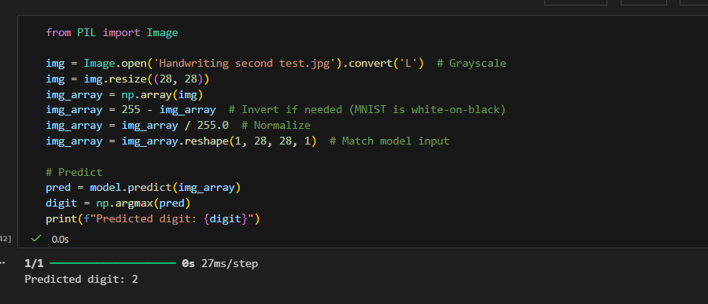

# Mini Project : Digit Recognition 

- I started by importing the MNIST dataset of handwritten digits using TensorFlow’s built-in datasets module.

- Then, I preprocessed the data by normalizing pixel values to a range of 0 to 1 and reshaping the images to match the input format expected by the model.

- Next, I designed a sequential neural network using TensorFlow’s Keras API, including dense layers with ReLU activation and a final softmax layer for 10-class classification.

- After compiling the model with the Adam optimizer, sparse categorical crossentropy loss, and accuracy metric, I trained it on the training data for several epochs.

- Once training was complete, I evaluated the model’s performance on the test set and achieved high accuracy.

- Finally, I used the trained model to make predictions on new handwritten digit images, successfully recognizing digits it had never seen before.

