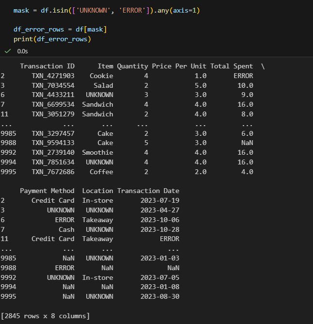
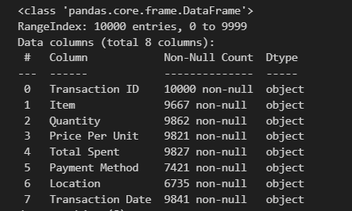
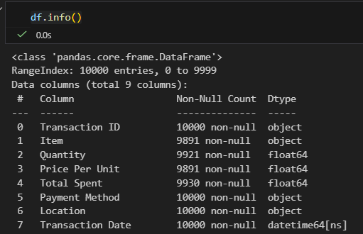
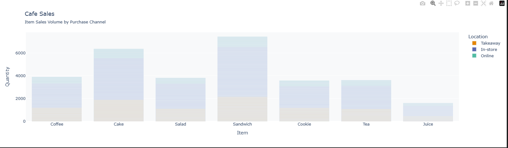

### Full Stack Data Project (Cafe Sales)

* Project overview ~
    - In this project demonstrates my ability to handle real-world, "dirty" data and transform it into a clean, actionable dataset for business insights.

* Key Insights ~
    1. Comprehensive Data Cleaning:
        - Identified and Resolved Data Anomalies: Conducted an initial audit of 10,000 records to identify "dirty" data points, including missing values (NaN) and erroneous placeholders like "ERROR" and "UNKNOWN".

        

    2. Data Type Standardization: 
        - Performed critical type conversions, transforming raw object strings into appropriate numerical (float), date (datetime), and categorical formats to enable mathematical analysis.

        From this 
        

        To this
        

    3. Rule-Based Imputation: 
        - Developed custom logic to reconstruct missing financial information. For instance,use existing `Total Spent` and `Price Per Unit` values to calculate missing `Quantity` data and so on so forth.

    4. Business Logic Mapping: 
        - Created mapping functions to cross-reference items with their fixed unit prices, ensuring data consistency across the entire dataset.

    5. Predictive Imputation (KNN): 
        - Instead of simply deleting rows with missing labels,implement a K-Nearest Neighbors (KNN) classifier is answers to predict and fill missing Item categories based on features like price, quantity, and location.

* Visualization
    - Visualized "Item Sales Volume by Purchase Channel" to compare performance across In-store, Takeaway, and Online platforms, providing a clear picture of customer behavior and revenue streams.

* Datasets ~
    - The datasets are sourced from the `KAGGLE` [Cafe Sales](https://www.kaggle.com/datasets/ahmedmohamed2003/cafe-sales-dirty-data-for-cleaning-training)
    