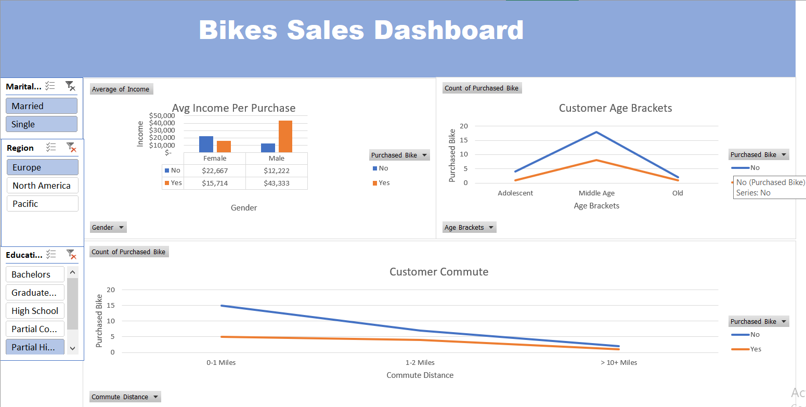

## FullStack Data Project (Bike Sales)

* Project Title:    
    - Customer Insights & Bike Purchase Behavior Analysis

* Project Overview:
    - Analyzed a customer dataset of bike buyers to uncover patterns in purchasing behavior based on demographics, income, commute distance, and age. Built dynamic dashboards using PivotTables and PivotCharts in Excel to support data-driven marketing and sales strategies.

* Key Activities & Technical Skills:
    
    1. Data Cleaning & Transformation
        - Standardized raw fields (e.g., converted “M”/“S” to “Married”/“Single”, cleaned “Commute Distance” categories like “10+ Miles” → “> 10+ Miles”).
        - Created derived metrics: Age Brackets (Adolescent, Middle Age, Old) using logical formulas (IF statements) to enable cohort analysis.

        

    2. Exploratory Data Analysis (EDA)
        - Identified key trends:
            - High-income males are more likely to purchase bikes.
            - Most buyers fall in the Middle Age group (30–59 years).
            - Shorter commutes (0–1 Miles) correlate with higher purchase volume.

        - Used PivotTables to summarize:
            - Average income by gender and purchase status
            - Purchase counts by age bracket, commute distance, and region

           

    3. Dashboard Development
        - Designed an executive-friendly Bikes Sales Dashboard with clear visual summaries.
        - Integrated PivotCharts (bar/column charts) to visualize:
        - Income vs. purchase decision by gender
        - Customer distribution across age brackets and commute ranges
        - Ensured interactivity through slicers/filters (implied by structured layout).

    4. Business Insight Generation
        - Discovered that male customers with income >$70K are the highest-value segment.
        - Noted low bike adoption among older customers and those with long commutes — potential areas for targeted campaigns.
        - Recommended focusing marketing efforts on middle-aged professionals in urban areas (short commutes, high disposable income).

* Visualizations : 

    

* Sources :
    - Github repo [AlexTheAnalyst](https://github.com/AlexTheAnalyst/Excel-Tutorial/blob/main/Excel%20Project%20Dataset.xlsx)