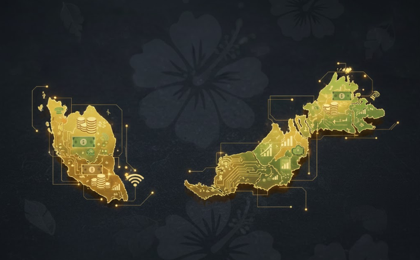

# Analysing Trends in Malaysian Household Income ( 2019, 2022 & 2024 )

* Project Overview
    - Problem: Identify pattern of income in Malaysia by state 
    - Goal: Visualize by percentile income in Malaysia
    
* Key Insights:
    - W.P. Putrajaya is the most income in Malaysia based on sum of mean & min in 2019, 2022 & 2024
    - W.p. Kuala Lumpur is the most income in Malaysia based on sum of median & max in all years.
    - While Kelantan is hold the record of the least income in Malaysia based on sum median & mean in all years.
    - If we compare the percentage of the least(RM 740) and the median income of Malaysia(RM 4119), we still get the biggest gap that is 556.62%.

* Visualization

 

* Datasets 
    - The datasets are sourced from the OPENDOSM ([Datasets household](https://open.dosm.gov.my/data-catalogue/hies_malaysia_percentile))
    