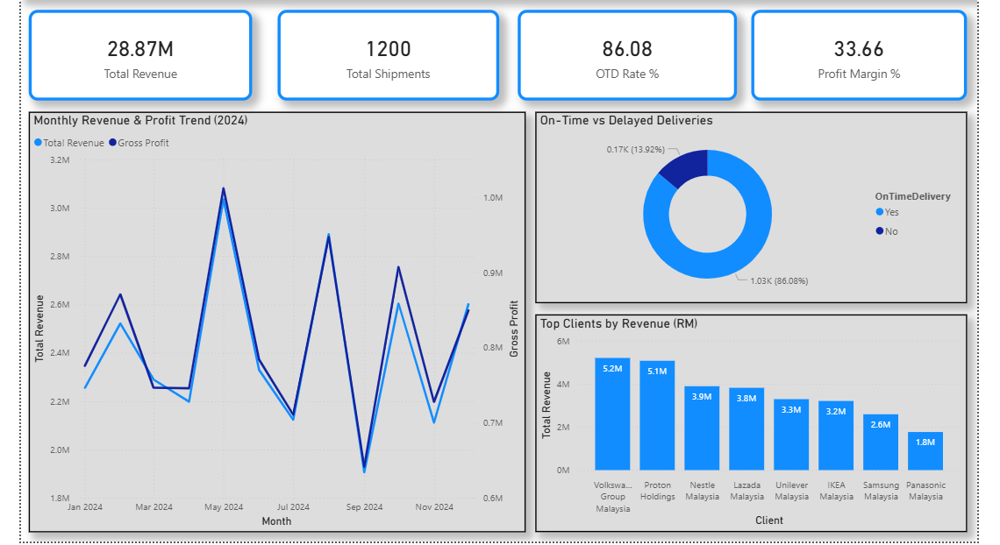
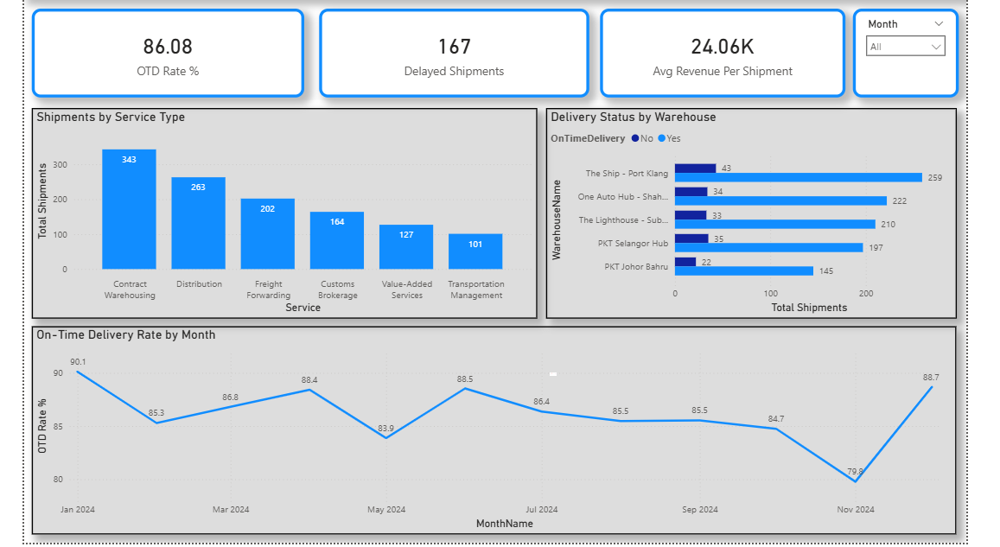
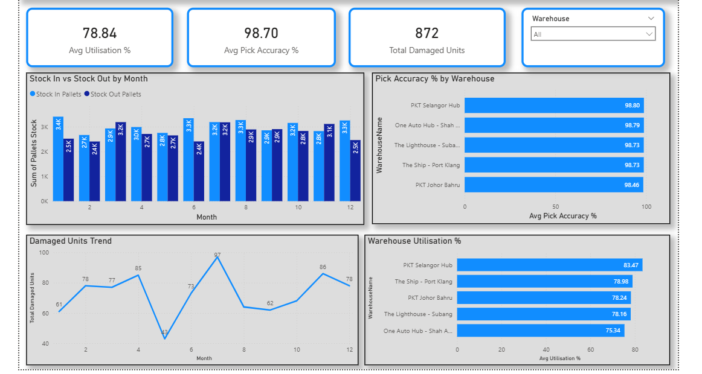
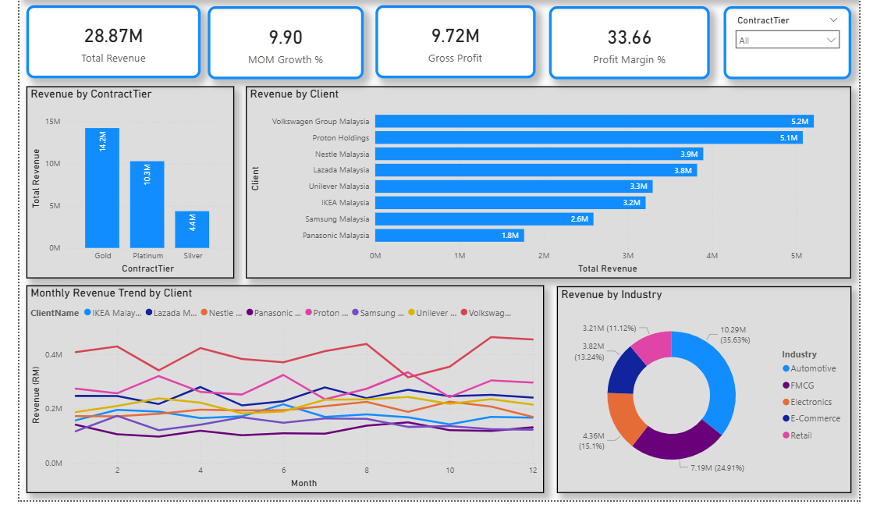

# 📊 Logistics Analysis — Power BI Dashboard

> A complete logistics performance dashboard built with Power BI, simulating real-world operations for **PKT Logistics Group Sdn Bhd** — one of Malaysia's leading integrated supply chain solutions providers.

---

## 🖼️ Dashboard Preview

### Page 1 — Executive Summary


### Page 2 — Delivery Performance


### Page 3 — Warehouse Operations


### Page 4 — Client Revenue Analysis


---

## 📌 Project Overview

This dashboard was built to demonstrate data analytics capabilities in the **logistics and supply chain** domain. It covers four key business areas:

- **Executive Summary** — High-level KPIs for revenue, shipments, OTD rate, and profit margin
- **Delivery Performance** — On-time delivery trends, service type breakdown, and warehouse comparison
- **Warehouse Operations** — Utilisation %, pick accuracy, stock movement, and damaged units trend
- **Client Revenue Analysis** — Revenue by client, industry, contract tier, and monthly trend

---

## 📁 Dataset Structure (Star Schema)

```
                    ┌─────────────────┐
                    │   dim_client    │
                    │  ClientID (PK)  │
                    └────────┬────────┘
                             │
          ┌──────────────────┼──────────────────┐
          │                  │                  │
┌─────────┴────────┐  ┌──────┴───────┐  ┌──────┴──────────┐
│  fact_shipments  │  │fact_monthly_ │  │ fact_inventory  │
│  (1,200 rows)    │  │revenue       │  │ (60 rows)       │
└─────────┬────────┘  └──────────────┘  └──────┬──────────┘
          │                                     │
    ┌─────┴──────┐                    ┌─────────┴────────┐
    │dim_service │                    │  dim_warehouse   │
    │dim_warehouse                   │  WarehouseID (PK)│
    └────────────┘                    └──────────────────┘
```

| Table | Rows | Description |
|---|---|---|
| `dim_client` | 8 | Client master data (Volkswagen, Unilever, Nestle...) |
| `dim_warehouse` | 5 | PKT warehouse locations (The Ship, The Lighthouse...) |
| `dim_service` | 6 | Service types (Warehousing, Freight, Customs...) |
| `fact_shipments` | 1,200 | Shipment transactions Jan–Dec 2024 |
| `fact_inventory` | 60 | Monthly inventory snapshots by warehouse |
| `fact_monthly_revenue` | 96 | Monthly revenue by client |

---

## 📐 DAX Measures

```dax
-- Revenue
Total Revenue = SUM(fact_shipments[Revenue_RM])
Gross Profit = [Total Revenue] - [Total Cost]
Profit Margin % = DIVIDE([Gross Profit], [Total Revenue], 0)

-- Delivery
OTD Rate % = DIVIDE([OTD Count], [Total Shipments], 0)
Delayed Shipments = [Total Shipments] - [OTD Count]
Avg Revenue Per Shipment = DIVIDE([Total Revenue], [Total Shipments], 0)

-- Time Intelligence
Revenue YTD = TOTALYTD([Total Revenue], 'Date'[Date])
MoM Growth % = DIVIDE([Total Revenue] - [Revenue PrevMonth], [Revenue PrevMonth], BLANK())

-- Warehouse
Avg Utilisation % = AVERAGE(fact_inventory[Utilisation_Pct])
Avg Pick Accuracy % = AVERAGE(fact_inventory[PickAccuracy_Pct])
```

---

## 🔍 Key Insights

### 💰 Revenue & Profitability
- Total Revenue: **RM 28.87M** across 1,200 shipments in 2024
- Gross Profit: **RM 9.72M** with a 33.66% profit margin
- **Gold tier** clients contribute the highest revenue at **RM 14.2M**
- **Automotive** is the largest industry segment at **35.63%** of total revenue

### 🚚 Delivery Performance
- Overall **OTD Rate: 86.08%** — 1,033 on-time out of 1,200 shipments
- **167 delayed shipments** across all warehouses
- **The Ship - Port Klang** handles the highest shipment volume (302 total)
- OTD rate dipped to **79.8%** in November — key area for improvement
- **Contract Warehousing** is the most used service (343 shipments)

### 🏭 Warehouse Operations
- Average warehouse utilisation: **78.84%** across all 5 hubs
- **PKT Selangor Hub** leads in utilisation at **83.47%**
- Average pick accuracy: **98.70%** — operationally excellent
- Damaged units peak in **Month 6 (97 units)** — potential seasonal factor

### 👥 Client Performance
- **Volkswagen Group Malaysia** is the top client at **RM 5.2M**
- **Proton Holdings** closely follows at **RM 5.1M** — strong automotive vertical
- **Platinum tier** clients (Volkswagen, Proton) deliver consistent monthly revenue

---

## 🛠️ Tools & Technologies


| Tool | Usage |
|---|---|
| **Power BI Desktop** | Dashboard development, DAX measures, data modelling |
| **Python (pandas)** | Dataset generation and simulation |
| **Excel** | Data validation and pre-processing |
| **DAX** | 15+ custom measures for KPIs and time intelligence |

---

## 🚀 How to Use

1. Clone this repository
```bash
git clone https://github.com/yourusername/pkt-powerbi-dashboard.git
```

2. Open `Simulated Datasets` — import all 6 sheets into Power BI Desktop

3. In Power BI **Model View**, create these relationships:

| From | To | Type |
|---|---|---|
| `fact_shipments[ClientID]` | `dim_client[ClientID]` | Many-to-One |
| `fact_shipments[WarehouseID]` | `dim_warehouse[WarehouseID]` | Many-to-One |
| `fact_shipments[ServiceID]` | `dim_service[ServiceID]` | Many-to-One |
| `fact_monthly_revenue[ClientID]` | `dim_client[ClientID]` | Many-to-One |
| `fact_inventory[WarehouseID]` | `dim_warehouse[WarehouseID]` | Many-to-One |

4. Create a **Date table** in Power BI:
```dax
Date = CALENDAR(DATE(2024,1,1), DATE(2024,12,31))
```

5. Add all DAX measures from the `⚡ DAX Measures` sheet into a dedicated `_Measures` table

---

## 👤 Author

**Muhammad Aminuddin**
Data Analyst | Power BI | Python | SQL

[](https://linkedin.com/in/yourprofile)
[](https://github.com/yourusername)

---

## 📄 License

This project is for portfolio and educational purposes. Dataset is fully simulated and does not represent actual PKT Group data.
