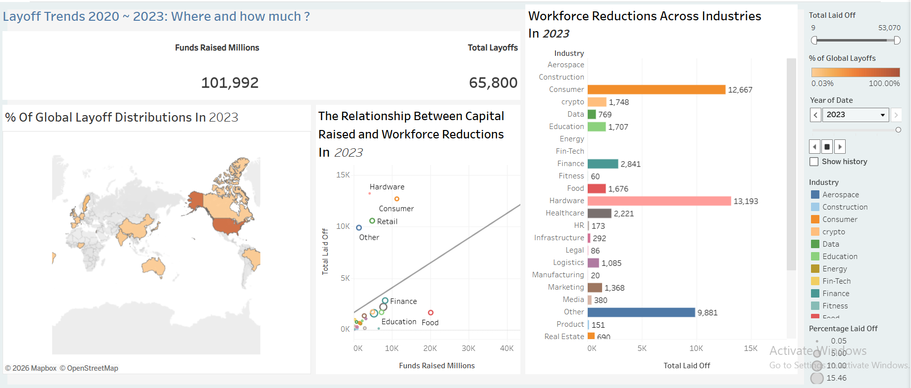

## EDA WITH SQL Syntax

* Project Overview :
    - In this project, I performed a comprehensive end-to-end data cleaning and transformation of a global layoffs dataset using MySQL. I focused on converting raw, inconsistent data into a high-integrity dataset ready for business intelligence and visualization. My process involved implementing advanced SQL techniques, including Common Table Expressions (CTEs) and Window Functions to identify and remove duplicate records.

* Key insights :

1. Advanced Data Deduplication
    - Methodology: I implemented Window Functions (ROW_NUMBER()) combined with Common Table Expressions (CTEs) to identify and isolate duplicate records.

    - The Problem I Solved: Real-world data often has redundant entries. By partitioning the data across multiple columns (Company, Location, Date, etc.), I ensured that only unique layoff events remained in the final dataset.

2. Strategic Schema Engineering
    - Staging Environment: I demonstrated best practices by creating a layoffs_staging table rather than working directly on the raw source data. This ensures data integrity and allows for an "undo" point during the cleaning process.

    - Schema Modification: I built a secondary staging table (layoffs_staging2) specifically to handle the row-level filtering required for cleaning, showcasing my ability to architect temporary data structures.

3. Data Standardization & "Fuzzy" Matching
    - Industry Normalization: I used LIKE operators and wildcard strings to find inconsistencies, such as different variations of "Crypto" (e.g., 'CryptoCurrency' vs 'Crypto'), and standardized them into a single category for accurate reporting.

    - Text Processing: I applied TRIM functions to remove leading/trailing whitespace and trailing punctuation (like fixing "United States." entries), ensuring that grouping and filtering in future visualizations (like Tableau) would be 100% accurate.

4. Date and Type Casting
    - Time-Series Readiness: I handled a common data issue where dates were imported as "Text". I used STR_TO_DATE to convert them and then used ALTER TABLE to change the column to a proper DATE format. This allows for time-based analysis (e.g., layoffs by month or year).

5. Handling Nulls and Missing Data
    - Self-Joins for Data Recovery: In cases where the "Industry" field was missing, I wrote a Self-Join to populate those nulls by looking up other records for the same company. This maximizes the amount of usable data.

    - Logical Deletion: I made the executive decision to remove records where both total_laid_off and percentage_laid_off were null, as these rows provided no quantitative value for analysis.

* Visualization (Tableau):

    - [Dashboard](https://public.tableau.com/app/profile/aminuddin.samsudin/viz/LayoffsTrends20202023Whereandhowmuch/Dashboard2)

    

* Sources :

    - https://www.kaggle.com/datasets/swaptr/layoffs-2022